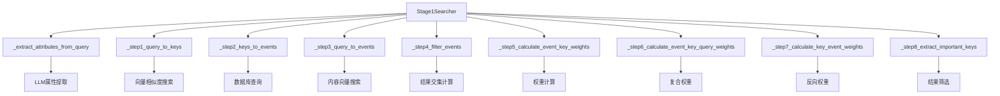

# Stage1 搜索模块完整测试指南

## 📋 目录

- [模块概述](#模块概述)
- [架构设计](#架构设计)
- [8步骤算法详解](#8步骤算法详解)
- [测试覆盖范围](#测试覆盖范围)
- [运行测试](#运行测试)
- [性能基准](#性能基准)
- [故障排除](#故障排除)
- [API使用示例](#api使用示例)

## 📖 模块概述

Stage1 模块实现了复合搜索算法的核心功能，通过8个步骤从用户查询中提取关键实体和事项。该模块是整个搜索系统的重要组成部分，负责语义扩展、权重计算和结果排序。

### 核心功能

- **语义扩展**: 使用LLM从查询中提取结构化属性
- **向量搜索**: 基于向量相似度查找相关实体和事项
- **权重计算**: 多层次的权重计算算法
- **结果排序**: 根据权重和相关性排序结果

## 🏗️ 架构设计

### 主要组件



### 数据流

1. **输入**: 用户查询 + 搜索配置
2. **处理**: 8步骤算法处理
3. **输出**: 排序后的关键实体列表

## 🔄 8步骤算法详解

### 步骤1: query找key（语义扩展）
```python
# 从查询中提取结构化属性
query_attributes = await self._extract_attributes_from_query(config.query)

# 使用向量搜索找到相似实体
similar_entities = await self.entity_repo.search_similar(
    query_vector=embedding_vector,
    entity_type=attribute_info["type"]
)
```

**功能**: 使用LLM提取查询中的实体，通过向量搜索找到相关实体

**输出**: 相关实体列表 + 权重向量

### 步骤2: key找event（精准匹配）
```python
# 查询包含这些key的所有event
query = select(EventEntity.event_id).where(
    EventEntity.entity_id.in_(key_entity_ids)
)
```

**功能**: 基于实体ID查找关联的事项

**输出**: 相关事项ID列表

### 步骤3: query再找event（语义匹配）
```python
# 通过内容向量搜索
content_similar_events = await self.event_repo.search_similar_by_content(
    query_vector=query_vector,
    source_config_id=config.source_config_id
)
```

**功能**: 通过向量相似度直接搜索相关事项

**输出**: 语义相似的事项列表 + 权重

### 步骤4: 过滤Event（精准筛选）
```python
# 取两个步骤结果的交集
query_event_ids = {event["event_id"] for event in event_query_related}
key_event_ids = set(event_key_query_related)
event_related = list(query_event_ids.intersection(key_event_ids))
```

**功能**: 只保留同时出现在两种搜索中的事项

**输出**: 精准匹配的事项和实体

### 步骤5: 计算event-key权重向量
```python
# W_event-key(ej) = Σ(k1)i (k_i ∈ e_j)
total_weight = sum(k1_weights.get(key_id, 0.0) for key_id in event_keys)
event_key_weights[event_id] = total_weight
```

**功能**: 计算每个事项包含的所有实体的权重之和

**输出**: 事项-实体权重字典

### 步骤6: 计算event-key-query权重向量
```python
# W_e2(ej) = W_event-key(ej) × (e1)j
event_key_query_weights[event_id] = key_weight * query_weight
```

**功能**: 结合事项-实体权重和查询相似度权重

**输出**: 复合权重字典

### 步骤7: 反向计算key权重向量
```python
# W_key-event(ki) = Σ W_e2(ej) (e_j contains k_i)
total_weight = sum(
    event_key_query_weights.get(event_id, 0.0)
    for event_id in key_events
)
key_event_weights[key_id] = total_weight
```

**功能**: 根据事项权重反向计算实体重要性

**输出**: 实体权重字典

### 步骤8: 提取重要的key
```python
# 按权重排序并应用阈值/Top-N筛选
sorted_keys = sorted(key_event_weights.items(), key=lambda x: x[1], reverse=True)
if config.top_n_keys:
    selected_keys = sorted_keys[: config.top_n_keys]
else:
    selected_keys = [k for k in sorted_keys if k[1] >= config.final_key_threshold]
```

**功能**: 根据权重提取最重要的实体

**输出**: 最终的关键实体列表

## 🧪 测试覆盖范围

### 单元测试

#### 1. 属性提取测试
- JSON Schema构建验证
- 响应解析逻辑测试
- 重要性到置信度映射
- 回退机制测试

#### 2. 权重计算测试
- 各步骤权重算法验证
- 边界条件处理
- 数值精度测试

#### 3. 数据结构测试
- Stage1Result序列化
- SearchConfig验证
- 错误处理机制

### 集成测试

#### 1. 完整流程测试
- 端到端搜索流程验证
- 真实LLM + Elasticsearch集成
- 多步骤协调测试

#### 2. 配置测试
- 参数验证
- 边界值测试
- 默认值测试

### 性能测试

#### 1. 响应时间测试
- 平均响应时间 < 5秒
- 95%响应时间 < 10秒
- 最大响应时间 < 15秒

#### 2. 并发测试
- 支持10个并发请求
- 错误率 < 5%
- 无内存泄漏

## 🚀 运行测试

### 环境准备

1. **安装依赖**
```bash
pip install -r requirements.txt
```

2. **配置环境变量**
```bash
# .env 文件
LLM_API_KEY=your_api_key
LLM_BASE_URL=https://api.openai.com/v1
LLM_MODEL=gpt-3.5-turbo
```

3. **启动依赖服务**
```bash
# Elasticsearch
docker-compose up -d elasticsearch

# 数据库（如果使用）
python scripts/init_database.py
```

### 运行命令

#### 单元测试
```bash
# 基础单元测试
pytest tests/search/test_stage1_complete.py -v

# 只运行特定测试类
pytest tests/search/test_stage1_complete.py::TestStage1UnitTests -v

# 运行性能测试
pytest tests/search/test_stage1_complete.py::TestStage1PerformanceTests -v -m slow
```

#### 集成测试
```bash
# 完整集成测试
python tests/search/test_stage1_complete.py --integration

# 模拟环境集成测试
pytest tests/search/test_stage1_complete.py -m integration
```

#### 测试报告
```bash
# 生成HTML报告
pytest tests/search/test_stage1_complete.py --html=reports/stage1_test_report.html

# 覆盖率报告
pytest tests/search/test_stage1_complete.py --cov=dataflow.modules.search --cov-report=html
```

## 📊 性能基准

### 预期性能指标

| 指标 | 目标值 | 说明 |
|------|--------|------|
| 平均响应时间 | < 5秒 | 完整8步骤搜索 |
| 属性提取时间 | < 2秒 | LLM调用部分 |
| 向量搜索时间 | < 1秒 | ES查询部分 |
| 内存使用 | < 100MB | 单次搜索 |
| 并发支持 | 10 QPS | 并发请求处理 |

### 测试场景基准

#### 简单查询
```
查询: "张三在北京工作"
预期时间: < 2秒
预期结果: 2-3个实体
```

#### 复杂查询
```
查询: "2024年春季，腾讯和阿里云在深圳联合举办人工智能技术峰会，讨论大模型和自动驾驶的发展趋势"
预期时间: < 8秒
预期结果: 5-8个实体
```

#### 批量测试
```
查询数量: 100个
并发数: 5个
成功率: > 95%
平均响应时间: < 5秒
```

## 🔧 故障排除

### 常见问题

#### 1. LLM API调用失败
```
错误: LLM属性抽取失败
原因: API密钥未配置或网络问题
解决: 检查.env文件配置
```

#### 2. Elasticsearch连接失败
```
错误: Elasticsearch 连接失败
原因: ES服务未启动或配置错误
解决: 检查docker-compose状态
```

#### 3. 数据库查询超时
```
错误: 数据库查询超时
原因: 数据库负载过高或索引缺失
解决: 检查数据库性能和索引
```

#### 4. 内存使用过高
```
错误: 内存使用过高
原因: 向量数据过大或内存泄漏
解决: 调整向量维度或检查代码
```

### 调试技巧

#### 1. 启用详细日志
```python
import logging
logging.basicConfig(level=logging.DEBUG)
```

#### 2. 检查中间结果
```python
# 在每个步骤后添加日志
logger.info(f"步骤1完成: 找到 {len(key_query_related)} 个相关key")
logger.info(f"步骤2完成: 找到 {len(event_key_query_related)} 个key相关event")
```

#### 3. 验证数据流
```python
# 检查关键节点的数据
print(f"提取的属性: {query_attributes}")
print(f"搜索到的实体: {key_query_related}")
print(f"最终的结果: {key_final}")
```

## 💻 API使用示例

### 基本使用

```python
from dataflow.modules.search.stage1 import Stage1Searcher
from dataflow.modules.search.config import SearchConfig

# 初始化搜索器
searcher = Stage1Searcher(llm_client, prompt_manager)

# 配置搜索参数
config = SearchConfig(
    source_config_id="your_source_config_id",
    query="人工智能技术发展趋势",
    key_similarity_threshold=0.7,
    event_similarity_threshold=0.6,
    max_keys=10,
    max_events=20,
    vector_k=5,
    top_n_keys=5,
    final_key_threshold=0.1
)

# 执行搜索
result = await searcher.search(config)

# 处理结果
print(f"找到 {len(result.key_final)} 个重要实体:")
for key in result.key_final:
    print(f"- {key['name']} (权重: {key['weight']:.2f})")
```

### 高级使用

```python
# 自定义配置
config = SearchConfig(
    source_config_id="custom_source",
    query="查询文本",
    key_similarity_threshold=0.8,  # 更高的相似度阈值
    event_similarity_threshold=0.75,
    max_keys=20,  # 更多候选实体
    max_events=50,
    vector_k=10,
    top_n_keys=8,
    final_key_threshold=0.05  # 更低的阈值，更多结果
)

# 处理中间结果
result = await searcher.search(config)

# 分析中间结果
print(f"步骤1结果: {len(result.key_query_related)} 个候选实体")
print(f"步骤3结果: {len(result.event_query_related)} 个相关事件")
print(f"步骤4结果: {len(result.event_related)} 个过滤后事件")
print(f"最终结果: {len(result.key_final)} 个重要实体")
```

### 错误处理

```python
try:
    result = await searcher.search(config)
    # 处理成功结果
    process_result(result)
except Exception as e:
    logger.error(f"Stage1搜索失败: {e}")
    # 处理错误情况
    handle_error(e)
```

## 📚 扩展阅读

- [事件提取模块文档](../extract/README.md)
- [向量搜索文档](../../docs/vector_search.md)
- [Elasticsearch配置](../../docs/elasticsearch_setup.md)
- [性能优化指南](../../docs/performance_tuning.md)

## 🤝 贡献指南

### 添加新测试用例

1. 在相应的测试类中添加新方法
2. 遵循命名约定: `test_<功能>_<场景>`
3. 添加适当的断言和错误检查

### 性能优化

1. 监控关键指标
2. 优化算法复杂度
3. 减少不必要的计算
4. 改进缓存策略

### 文档更新

1. 更新API变更
2. 添加新功能说明
3. 修正错误信息
4. 改进示例代码

---

最后更新: 2024年10月20日